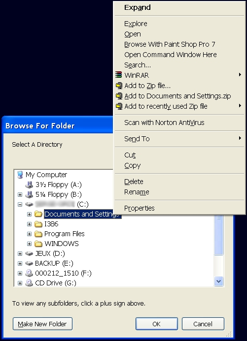

<div align="center">

## Browse For Folder   Version 2


</div>

### Description

Browse For Folder, Make New Folder, Form can be resize, Right Click Menu (Like in Explorer)
 
### More Info
 


<span>             |<span>
---                |---
**Submitted On**   |
**By**             |[Serge Lachapelle](https://github.com/Planet-Source-Code/PSCIndex/blob/master/ByAuthor/serge-lachapelle.md)
**Level**          |Intermediate
**User Rating**    |5.0 (35 globes from 7 users)
**Compatibility**  |VB 6\.0
**Category**       |[Windows API Call/ Explanation](https://github.com/Planet-Source-Code/PSCIndex/blob/master/ByCategory/windows-api-call-explanation__1-39.md)
**World**          |[Visual Basic](https://github.com/Planet-Source-Code/PSCIndex/blob/master/ByWorld/visual-basic.md)
**Archive File**   |[](https://github.com/Planet-Source-Code/serge-lachapelle-browse-for-folder-version-2__1-41975/archive/master.zip)


### Source Code

```
Option Explicit
Public Const MAX_PATH = 260
Private Type BrowseInfo
 hWndOwner  As Long
 pIDLRoot  As Long
 pszDisplayName As Long
 lpszTitle  As Long
 ulFlags  As Long
 lpfnCallback As Long
 lParam   As Long
 iImage   As Long
End Type
Private Type SH_ITEM_ID
 cb As Long
 abID As Byte
End Type
Private Type ITEMIDLIST
 mkid As SH_ITEM_ID
End Type
Private Const WM_USER = &H400
Private Const BFFM_INITIALIZED = 1
Private Const BFFM_SELCHANGED = 2
Private Const BFFM_SETSTATUSTEXT = (WM_USER + 100)
Private Const BFFM_SETSELECTION = (WM_USER + 102)
'Private Const BFFM_SETOKTEXT = (WM_USER + 105)
Private Const BIF_DEFAULT = &H0
Private Const BIF_RETURNONLYFSDIRS = &H1  ' only local Directory
Private Const BIF_DONTGOBELOWDOMAIN = &H2
Private Const BIF_STATUSTEXT = &H4   ' not with BIF_NEWDIALOGSTYLE
Private Const BIF_RETURNFSANCESTORS = &H8
Private Const BIF_EDITBOX = &H10
Private Const BIF_VALIDATE = &H20   ' use with BIF_EDITBOX or BIF_USENEWUI
Private Const BIF_NEWDIALOGSTYLE = &H40  ' Use OleInitialize before
Private Const BIF_USENEWUI = &H50   ' = (BIF_NEWDIALOGSTYLE + BIF_EDITBOX)
Private Const BIF_BROWSEINCLUDEURLS = &H80
Private Const BIF_UAHINT = &H100    ' use with BIF_NEWDIALOGSTYLE, add Usage Hint if no EditBox
Private Const BIF_NONEWFOLDERBUTTON = &H200
Private Const BIF_NOTRANSLATETARGETS = &H400
Private Const BIF_BROWSEFORCOMPUTER = &H1000
Private Const BIF_BROWSEFORPRINTER = &H2000
Private Const BIF_BROWSEINCLUDEFILES = &H4000
Private Const BIF_SHAREABLE = &H8000   ' use with BIF_NEWDIALOGSTYLE
Private Declare Function PathIsDirectory Lib "shlwapi.dll" Alias "PathIsDirectoryA" (ByVal pszPath As String) As Long
Private Declare Function SHBrowseForFolder Lib "shell32.dll" (lpbi As BrowseInfo) As Long
Private Declare Function SHGetPathFromIDList Lib "shell32.dll" (ByVal pidList As Long, ByVal lpBuffer As String) As Long
Private Declare Sub CoTaskMemFree Lib "ole32.dll" (ByVal hMem As Long)
Private Declare Function lstrcat Lib "Kernel32.dll" Alias "lstrcatA" (ByVal lpString1 As String, ByVal lpString2 As String) As Long
Private Declare Function SendMessage Lib "user32.dll" Alias "SendMessageA" (ByVal HWND As Long, ByVal wMsg As Long, ByVal wParam As Long, ByVal lParam As String) As Long
Private Declare Function SHParseDisplayName Lib "shell32.dll" (ByVal pszName As Long, ByVal pbc As Long, ByRef ppidl As Long, ByVal sfgaoIn As Long, ByRef psfgaoOut As Long) As Long
Private Declare Function SHGetSpecialFolderLocation Lib "shell32.dll" (ByVal hWndOwner As Long, ByVal nFolder As Long, pidl As ITEMIDLIST) As Long
Private Declare Sub OleInitialize Lib "ole32.dll" (pvReserved As Any)
'Private Declare Sub CopyMemory Lib "Kernel32.dll" Alias "RtlMoveMemory" (Destination As Any, Source As Any, ByVal Length As Long)
Private m_CurrentDirectory As String
'Private NEW_OK_TEXT As String
Private Function GetAddressofFunction(add As Long) As Long
 GetAddressofFunction = add
End Function
Private Function BrowseCallbackProc(ByVal HWND As Long, ByVal uMsg As Long, ByVal lp As Long, ByVal pData As Long) As Long
 On Local Error Resume Next
 Dim lpIDList As Long, ret As Long, sBuffer As String, qwe As String
 Select Case uMsg
 Case BFFM_INITIALIZED
  SendMessage HWND, BFFM_SETSELECTION, 1, m_CurrentDirectory
'  If NEW_OK_TEXT <> vbNullString Then SendMessage HWND, BFFM_SETOKTEXT, 1, NEW_OK_TEXT
 Case BFFM_SELCHANGED
  sBuffer = Space(MAX_PATH)
  ret = SHGetPathFromIDList(lp, sBuffer)
  If ret = 1 Then
  SendMessage HWND, BFFM_SETSTATUSTEXT, 0, sBuffer
  End If
 End Select
 BrowseCallbackProc = 0
End Function
Public Function BrowseForFolder(Optional ByVal Title As String = "", Optional ByVal RootDir As String = "", Optional ByVal StartDir As String = "", Optional owner As Form = Nothing, Optional ByVal NewStyle As Boolean = True, Optional ByVal IncludeFiles As Boolean = False) As String
 Dim lpIDList As Long, lpIDList2 As Long, IDL As ITEMIDLIST
 Dim sBuffer As String, tBrowseInfo As BrowseInfo, r As Long
' If Len(NewTextForOkButton) > 0 Then
' CopyMemory NEW_OK_TEXT, ByVal VarPtr(NewTextForOkButton), 4
' Else
' NEW_OK_TEXT = vbNullString
' End If
 If Len(RootDir) > 0 Then
 If PathIsDirectory(RootDir) Then
  SHParseDisplayName StrPtr(RootDir), ByVal 0&, lpIDList2, ByVal 0&, ByVal 0&
  tBrowseInfo.pIDLRoot = lpIDList2
 Else
  r = SHGetSpecialFolderLocation(ByVal 0&, &H11, IDL) ' get "My Computer" Folder
  If r = 0 Then tBrowseInfo.pIDLRoot = IDL.mkid.cb
 End If
 Else
 r = SHGetSpecialFolderLocation(ByVal 0&, &H11, IDL) ' get "My Computer" Folder
 If r = 0 Then tBrowseInfo.pIDLRoot = IDL.mkid.cb
 End If
 If Len(StartDir) > 0 Then
 m_CurrentDirectory = StartDir & vbNullChar
 Else
 m_CurrentDirectory = vbNullChar
 End If
 If Len(Title) > 0 Then
 tBrowseInfo.lpszTitle = lstrcat(Title, "")
 Else
 tBrowseInfo.lpszTitle = lstrcat("Select A Directory", "")
 End If
 tBrowseInfo.lpfnCallback = GetAddressofFunction(AddressOf BrowseCallbackProc)
 tBrowseInfo.ulFlags = BIF_RETURNONLYFSDIRS
 If IncludeFiles Then tBrowseInfo.ulFlags = tBrowseInfo.ulFlags + BIF_BROWSEINCLUDEFILES
 If NewStyle Then
 tBrowseInfo.ulFlags = tBrowseInfo.ulFlags + BIF_NEWDIALOGSTYLE + BIF_UAHINT
 OleInitialize Null ' Initialize OLE and COM
 Else
 tBrowseInfo.ulFlags = tBrowseInfo.ulFlags + BIF_STATUSTEXT
 End If
 If Not (owner Is Nothing) Then tBrowseInfo.hWndOwner = owner.HWND
 lpIDList = SHBrowseForFolder(tBrowseInfo)
 If Len(RootDir) > 0 Then
 If PathIsDirectory(RootDir) Then CoTaskMemFree lpIDList2
 End If
 If (lpIDList) Then
 sBuffer = Space(MAX_PATH)
 SHGetPathFromIDList lpIDList, sBuffer
 CoTaskMemFree lpIDList
 sBuffer = Left(sBuffer, InStr(sBuffer, vbNullChar) - 1)
 BrowseForFolder = sBuffer
 Else
 BrowseForFolder = ""
 End If
End Function
```

